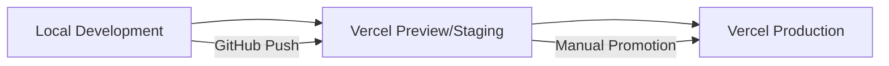

# Staging Strategy & Implementation Guide
*Last Updated: February 23, 2024*

## Overview

This document combines our staging strategy for both portfolio presentation and technical implementation.

## 🎯 Staging Philosophy

### Portfolio Context
- Simplified but professional approach
- Demonstrates industry best practices
- Focuses on showcasing technical knowledge

### Technical Requirements
- Safe testing environment
- Quality assurance platform
- Pre-production verification

## 🏗 Environment Structure



### 1. Development (Local)
- Development setup
- Feature testing
- Quick iterations
- Uses `.env.local`

### 2. Staging (Vercel Preview)
- Integration testing
- Quality verification
- Automated deployments
- Uses `.env.staging`

### 3. Production (Vercel)
- Final deployment
- Portfolio showcase
- Stable features only
- Uses `.env.production`

## 🛠 Implementation

### Configuration
```javascript
// vercel.json
{
  "env": {
    "PEXELS_API_KEY": "@pexels_api_key",
    "ENVIRONMENT": "production"
  },
  "git": {
    "deploymentEnabled": {
      "main": true,
      "staging": true
    }
  }
}
```

### Feature Management
```typescript
// src/config/features.ts
const features = {
  development: {
    newVideoPlayer: true,
    aiRecommendations: true
  },
  preview: {
    newVideoPlayer: true,
    aiRecommendations: false
  },
  production: {
    newVideoPlayer: true,
    aiRecommendations: false
  }
};
```

## 📋 Quality Gates

### Before Staging
- [ ] Local tests pass
- [ ] Code linting passes
- [ ] Feature works locally
- [ ] Documentation updated

### Before Production
- [ ] Staging deployment verified
- [ ] All tests pass
- [ ] Performance benchmarks met
- [ ] Security checks passed

## 🔄 Development Workflow

### 1. Local Development
```bash
# Setup
git clone https://github.com/your-username/modern-streaming-hub.git
bun install

# Development
bun run dev
```

### 2. Feature Development
```bash
# Create feature branch
git checkout -b feature/new-video-player

# Enable feature flag
# In .env.local
NEXT_PUBLIC_ENABLE_NEW_VIDEO_PLAYER=true
```

### 3. Staging Deployment
```bash
# Push changes
git push origin feature/new-video-player

# Vercel automatically creates preview
```

### 4. Production Deployment
```bash
# After approval
git checkout main
git merge feature/new-video-player
git push origin main
```

## 🔍 Testing Strategy

### Environment-Specific Tests
```typescript
describe('VideoPlayer in production', () => {
  beforeEach(() => {
    process.env.NEXT_PUBLIC_VERCEL_ENV = 'production';
  });

  it('only shows stable features', () => {
    expect(isFeatureEnabled('aiRecommendations')).toBe(false);
  });
});
```

## 📊 Monitoring

### Vercel Analytics
- Performance monitoring
- Usage statistics
- Error tracking

### Custom Logging
```typescript
export const logError = (error: Error, context?: object) => {
  if (process.env.NEXT_PUBLIC_VERCEL_ENV === 'production') {
    console.error(error, context);
  }
};
```

## 🎓 Portfolio Presentation

### README Documentation
```markdown
## Development & Deployment

This project follows industry-standard practices:

- Feature flags for controlled rollouts
- Automated preview deployments
- CI/CD pipeline with GitHub Actions
- Environment-specific configurations
- Comprehensive testing strategy
```

## 💡 Interview Talking Points

1. **Professional Practices**
   - Staging strategy
   - Feature flag usage
   - Testing approach

2. **Technical Knowledge**
   - Environment management
   - Deployment pipeline
   - Quality assurance

3. **Real Examples**
   - Preview deployments
   - Feature flags
   - Test coverage

## 📚 Resources

- [Vercel Documentation](https://vercel.com/docs)
- [Feature Flags Guide](../development/features/flags.md)
- [Testing Documentation](../development/testing/README.md)

## 🔄 Maintenance

### Weekly Tasks
- Review deployment logs
- Check error reports
- Update documentation

### Monthly Tasks
- Security audit
- Performance review
- Feature flag cleanup

### Quarterly Tasks
- Infrastructure review
- Cost optimization
- Strategy adjustment 