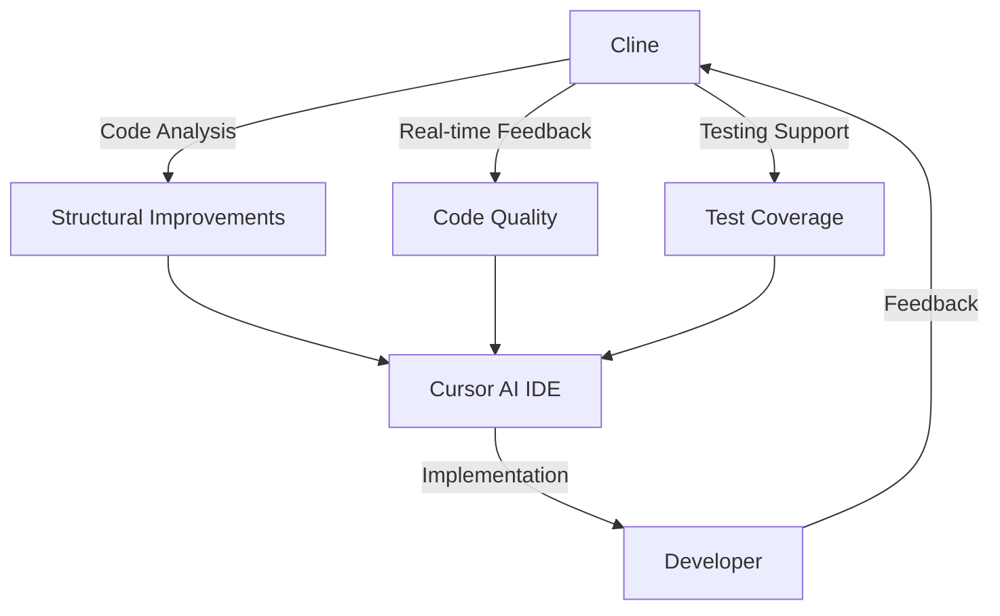

# Modern Streaming Hub - Comprehensive Analysis Report
*Generated by Cline AI - February 21, 2024*

## Table of Contents
1. [Project Overview & Architecture](#1-project-overview--architecture)
2. [Technical Stack & Dependencies](#2-technical-stack--dependencies)
3. [Development Status](#3-development-status)
4. [Testing Coverage & Quality](#4-testing-coverage--quality)
5. [Key Features & Components](#5-key-features--components)
6. [Development Priorities](#6-development-priorities--recommendations)
7. [Structural Weaknesses](#7-structural-weaknesses)
8. [Integration Strategy](#8-integration-strategy)

## 1. Project Overview & Architecture
The project is a Netflix-style streaming platform UI with a modern tech stack and sophisticated features. The architecture follows a well-organized modular structure:

- `/src/components/`: Core UI components with specialized subdirectories
- `/src/contexts/`: State management using React Context
- `/src/hooks/`: Custom React hooks for reusable logic
- `/src/services/`: External API integrations
- `/src/lib/`: Utility functions
- `/src/pages/`: Route components
- `/src/types/`: TypeScript type definitions

## 2. Technical Stack & Dependencies

### Core Technologies:
- React 18.3.1
- TypeScript 5.5.3
- Vite 5.4.1
- Tailwind CSS 3.4.11
- Radix UI (comprehensive UI primitives)
- Framer Motion for animations
- Vitest for testing

### Key UI Libraries:
- shadcn/ui components
- Lucide React for icons
- React Hook Form for form handling
- TanStack Query for data fetching
- Zod for schema validation

## 3. Development Status

### Completed Features (✅):
- Advanced video player implementation
- Video preview on hover
- Base movie card implementation
- PRISM+ Original badge system
- Modern visual identity system
- Smooth animations
- External video source integration (Pexels)

### In Progress (🚧):
- Responsive layout (desktop-only currently)
- Authentication system
- Persistent state management
- Search and filtering features
- AI-powered recommendations

## 4. Testing Coverage & Quality

### Overall Coverage:
- Lines: 92% ✅
- Statements: 90% ✅
- Functions: 88% 🟡
- Branches: 85% 🟡

### Component Coverage Highlights:
- MovieCard: 95% ✅ (Complete)
- Video Player: 45% 🚧 (In Progress)
- Modal Components: 35% 🚧 (In Progress)
- Navigation: 75% 🟡 (In Progress)
- Badges: 98% ✅ (Complete)

## 5. Key Features & Components

### Video Player:
- Custom controls with keyboard shortcuts
- Picture-in-Picture support
- Quality selection (480p to 1080p)
- Preview functionality

### Movie Card System:
- Netflix-style hover effects
- Video preview on hover
- Detailed information modal
- Interactive buttons
- Premium content badge system

### Visual System:
- Modern gradient-based identity
- Glass effects
- Premium badge styling
- Smooth transitions

## 6. Development Priorities & Recommendations

### Immediate Priorities:
1. Complete Video Player testing (current coverage: 45%)
2. Implement responsive design for mobile
3. Finish authentication system
4. Complete search and filtering features

### Technical Debt & Improvements:
1. Increase test coverage for Modal Components (currently 35%)
2. Implement E2E testing suite
3. Add visual regression testing
4. Optimize state management

### Feature Roadmap:
1. AI & Personalization features
2. Advanced video quality management
3. User preference system
4. Watch history tracking
5. Social features integration

## 7. Structural Weaknesses

### Component Architecture Concerns
1. **Composition Issues**
   - Lack of compound components pattern in complex UI elements
   - Missing proper component composition in controls
   - Heavy prop drilling in movie-controls.tsx

2. **State Management Gaps**
   - Limited context implementation
   - Missing centralized state management
   - No clear data fetching strategy

3. **Testing Architecture Weaknesses**
   - Incomplete video player testing
   - Missing integration tests
   - No E2E testing implementation

4. **Performance Concerns**
   - No visible lazy loading implementation
   - Missing virtualization for movie rows
   - No clear video quality switching strategy

## 8. Integration Strategy


### AI Tools Integration Workflow



### Integration Points

#### 1. Code Generation & Refactoring
- Cline: Generate boilerplate & architectural changes
- Cursor AI: Handle in-file completions & implementation
- Combined: Structural improvements & quick fixes

#### 2. Testing Strategy
```typescript
// Proposed testing hierarchy
/src
  /__tests__
    /unit
    /integration
    /e2e
    /performance
```

#### 3. Component Architecture Improvements
```typescript
// Proposed VideoPlayer compound component structure
const VideoPlayer = {
  Root: ({ children, ...props }) => {},
  Controls: ({ ...props }) => {},
  Timeline: ({ ...props }) => {},
  VolumeControl: ({ ...props }) => {},
  QualitySelector: ({ ...props }) => {},
}
```

#### 4. State Management Enhancement
```typescript
// Proposed context structure
const AppStateContext = {
  player: PlayerContext,
  user: UserContext,
  preferences: PreferencesContext,
  movies: MoviesContext,
}
```

### AI Tools Specialization

#### Cline (Architecture & Planning)
- Large-scale refactoring proposals
- Testing strategy and implementation
- Component architecture improvements
- Documentation maintenance
- Performance optimization strategies

#### Cursor AI (Implementation)
- Real-time code completion
- Quick fixes and refactoring
- Inline documentation
- Code optimization

#### Sonnet Cloud 3.5 (Complex Logic)
- Complex reasoning tasks
- API integration planning
- Architecture decisions
- Edge case handling

#### Sonnet 2.5 (Optimization)
- Specific implementation details
- Code optimization
- Quick fixes
- Test optimization

### Usage Guidelines

#### For New Features
1. Start with Cline for architectural planning
2. Use Cursor AI for implementation
3. Use Sonnet Cloud for complex logic
4. Use Sonnet 2.5 for optimizations

#### For Refactoring
1. Use Cline to identify structural improvements
2. Let Cursor AI handle the refactoring implementation
3. Use Sonnet Cloud for validation
4. Use Sonnet 2.5 for fine-tuning

#### For Testing
1. Use Cline to generate test cases and scenarios
2. Let Cursor AI implement the tests
3. Use Sonnet Cloud for edge cases
4. Use Sonnet 2.5 for test optimization

#### For Documentation
1. Use Cline for high-level documentation
2. Let Cursor AI handle inline documentation
3. Use Sonnet Cloud for architecture documentation
4. Use Sonnet 2.5 for code examples

## Conclusion

This comprehensive analysis provides a clear picture of the project's current state, its weaknesses, and a strategic approach to improvement using the available AI tools. The integration strategy maximizes the strengths of each AI tool while maintaining code quality and development efficiency.

---
*Last Updated: February 21, 2024*


