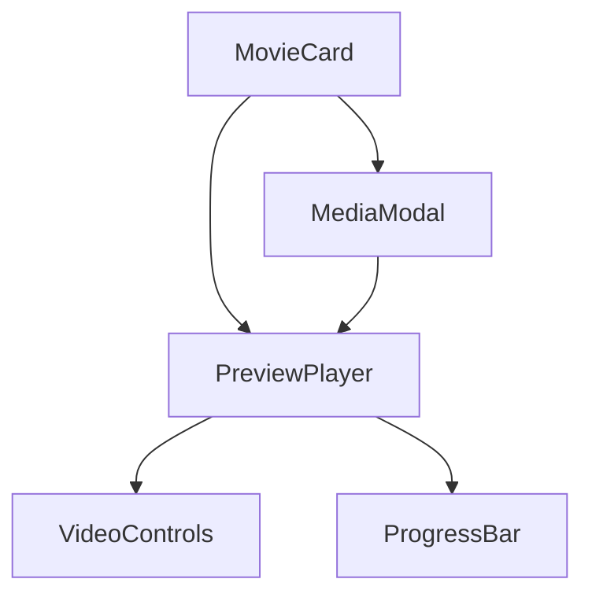

Yes, let's create a detailed refactoring plan that maintains stability while improving our codebase. I'll break this down into phases with clear checkpoints.

First, let me fetch our TDD workflow rule to ensure we follow best practices:

Ran tool


Perfect. Following our TDD workflow, here's our comprehensive refactoring plan:

# Refactoring Plan: Phase-by-Phase Approach

## Phase 1: Badge System Extraction
**Goal**: Isolate badge components for better reusability and maintenance

1. **Setup & Testing (Current State Preservation)**
```typescript
// 1. Create test file
src/components/ui/badges/__tests__/media-badge.test.tsx
src/components/ui/badges/__tests__/badge-variants.test.tsx

// 2. Create component files
src/components/ui/badges/
  ├── media-badge.tsx      // Base badge component
  ├── top-ten-badge.tsx
  ├── new-badge.tsx
  ├── award-badge.tsx
  └── original-badge.tsx
```

2. **Implementation Steps**
   a. Write tests for base MediaBadge
   b. Extract badge logic from MovieCard
   c. Create specialized badge components
   d. Update MovieCard to use new badge components
   e. Verify all tests pass

## Phase 2: Video Player Component
**Goal**: Create a reusable video player with consistent controls

1. **Component Structure**
```typescript
src/components/ui/video-player/
  ├── __tests__/
  │   ├── video-player.test.tsx
  │   ├── video-controls.test.tsx
  │   └── video-progress.test.tsx
  ├── video-player.tsx
  ├── video-controls.tsx
  ├── video-progress.tsx
  └── video-overlay.tsx
```

2. **Implementation Steps**
   a. Write tests for video functionality
   b. Extract video logic from Hero component
   c. Create reusable video controls
   d. Implement progress tracking
   e. Add overlay controls

## Phase 3: Modal System Refactoring
**Goal**: Create a flexible modal system for media content

1. **Component Structure**
```typescript
src/components/ui/media-modal/
  ├── __tests__/
  │   ├── media-modal.test.tsx
  │   └── media-details.test.tsx
  ├── media-modal.tsx
  ├── media-details.tsx
  └── media-actions.tsx
```

2. **Implementation Steps**
   a. Write tests for modal behavior
   b. Extract modal logic from MovieCard
   c. Create reusable media details component
   d. Implement standardized action buttons
   e. Update existing components to use new modal system

## Phase 4: Performance Optimization
**Goal**: Improve loading and interaction performance

1. **Custom Hooks**
```typescript
src/hooks/
  ├── __tests__/
  │   ├── use-image-preload.test.ts
  │   ├── use-transition-state.test.ts
  │   └── use-media-query.test.ts
  ├── use-image-preload.ts
  ├── use-transition-state.ts
  └── use-media-query.ts
```

2. **Implementation Steps**
   a. Write tests for each hook
   b. Implement image preloading
   c. Optimize transition states
   d. Add responsive media queries
   e. Update components to use new hooks

## Phase 5: Integration Testing
**Goal**: Ensure components work together seamlessly

1. **Test Structure**
```typescript
src/components/ui/__tests__/integration/
  ├── movie-card-interactions.test.tsx
  ├── video-player-modal.test.tsx
  └── user-interaction-flows.test.tsx
```

2. **Implementation Steps**
   a. Write integration tests
   b. Test component interactions
   c. Verify state management
   d. Test user flows
   e. Measure performance metrics

## Execution Strategy

1. **For Each Phase**:
   - Create feature branch
   - Write tests first
   - Implement changes
   - Run all tests
   - Review performance
   - Merge only when stable

2. **Checkpoints**:
   - ✅ All tests pass
   - ✅ No performance regression
   - ✅ Maintains accessibility
   - ✅ Code review completed
   - ✅ Documentation updated

3. **Rollback Plan**:
   - Keep old components until new ones are stable
   - Maintain version control tags
   - Document migration steps

Would you like to proceed with Phase 1: Badge System Extraction? We can start by writing tests for the base MediaBadge component while maintaining our current stable state.

# Component Layout and Structure

## Current Component Structure

```typescript
src/
├── components/
│   ├── ui/
│   │   ├── movie-card/
│   │   │   ├── movie-card.tsx
│   │   │   ├── movie-info-modal.tsx
│   │   │   └── __tests__/
│   │   ├── badges/
│   │   │   ├── media-badge.tsx
│   │   │   ├── top-ten-badge.tsx
│   │   │   └── ...
│   │   └── video-player/
│   │       └── ...
│   ├── hero.tsx
│   ├── movie-row.tsx
│   └── top-10-row.tsx
└── ...
```

## Planned Refactoring Structure

### 1. Movie Card System
```typescript
src/components/ui/movie-card/
├── movie-card.tsx           // Main component
├── preview-player.tsx       // New preview component
├── card-content.tsx         // Extracted content component
├── card-actions.tsx         // Extracted actions
└── __tests__/
    ├── movie-card.test.tsx
    ├── preview-player.test.tsx
    └── integration.test.tsx
```

### 2. Modal System
```typescript
src/components/ui/modal/
├── base-modal.tsx           // Base modal component
├── media-modal/
│   ├── index.tsx           // Main media modal
│   ├── content.tsx         // Modal content
│   ├── actions.tsx         // Modal actions
│   └── preview.tsx         // Modal preview
├── hooks/
│   ├── use-modal.ts
│   └── use-modal-state.ts
└── __tests__/
    ├── base-modal.test.tsx
    ├── media-modal.test.tsx
    └── hooks.test.tsx
```

### 3. Video Player System
```typescript
src/components/ui/video-player/
├── video-player.tsx         // Main player
├── controls/
│   ├── index.tsx           // Controls container
│   ├── play-pause.tsx      // Play/Pause control
│   ├── volume.tsx          // Volume control
│   └── fullscreen.tsx      // Fullscreen control
├── progress/
│   ├── index.tsx           // Progress container
│   └── timeline.tsx        // Timeline component
└── __tests__/
    ├── video-player.test.tsx
    ├── controls.test.tsx
    └── progress.test.tsx
```

## Shared Components
```typescript
src/components/ui/shared/
├── buttons/
│   ├── icon-button.tsx
│   └── action-button.tsx
├── overlays/
│   ├── gradient-overlay.tsx
│   └── loading-overlay.tsx
└── animations/
    ├── fade.tsx
    └── scale.tsx
```

## Implementation Order

1. **Phase 1: Movie Card Enhancement**
   - Add preview functionality
   - Extract shared components
   - Implement animations

2. **Phase 2: Modal System**
   - Create base modal
   - Implement media modal
   - Add preview support

3. **Phase 3: Video Player**
   - Build core player
   - Add controls
   - Implement progress

## Component Dependencies



## Styling Strategy

1. **Base Styles**
   - Tailwind utility classes
   - Consistent spacing
   - Responsive design

2. **Animations**
   - Transition classes
   - Transform utilities
   - Custom keyframes

3. **Theme Integration**
   - Color system
   - Typography
   - Spacing scale

