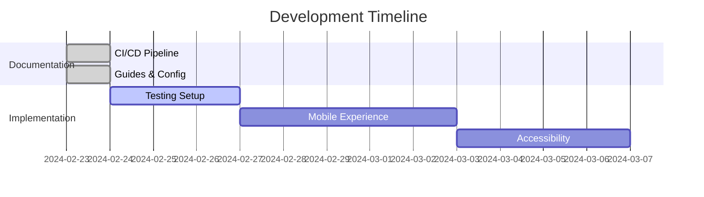

# 📚 Development Session Summaries

## 📋 Table of Contents
1. [Previous Sessions Overview](#previous-sessions-overview-february-23-2024)
2. [Current Session Goals](#current-session-goals)
3. [Resources & Links](#resources--links)

---

## 🗓 Previous Sessions Overview (February 23, 2024)

### 📝 Documentation Infrastructure

#### 1. CI/CD Documentation 🔄
- ✨ Created comprehensive CI/CD pipeline documentation structure
- 📄 Implemented main `README.md` with pipeline overview
- 🗂 Established directory structure:
  ```
  docs/development/ci-cd/
  ├── 📑 README.md
  ├── 🔄 workflows/
  │   └── main.yml
  ├── 📚 guides/
  │   ├── setup.md
  │   ├── deployment.md
  │   └── monitoring.md
  ├── ⚙️ configuration/
  │   ├── github-actions.md
  │   ├── vercel.md
  │   └── branch-protection.md
  └── 🛠 maintenance/
      ├── troubleshooting.md
      └── best-practices.md
  ```

#### 2. Key Documentation Created 📊

##### CI/CD Pipeline 🔄
- **Main Workflow**: Implemented GitHub Actions workflow with:
  - 🔍 Quality checks (TypeScript, ESLint, Tests)
  - 🚀 Preview deployments for PRs
  - 🌐 Staging deployments for main branch
  - ✨ Production deployments for version tags

##### Deployment Strategy 🚀
- 🌟 Established three-environment deployment strategy:
  - 🔬 Preview (PR-based)
  - 🧪 Staging (main branch)
  - 🎯 Production (version tags)
- 📋 Documented deployment procedures and rollback processes

##### Monitoring & Maintenance 📊
- 📈 Created comprehensive monitoring guide
- ⚠️ Established alert thresholds and incident response procedures
- 🔧 Documented maintenance best practices

### 🛠 Technical Implementation

#### 1. GitHub Actions Setup ⚙️
- 🔄 Configured main CI/CD pipeline
- 🎯 Implemented quality gates:
  - ✅ Type checking
  - 🔍 Linting
  - 🧪 Testing
  - 🏗 Build verification
- 🚀 Setup deployment workflows for multiple environments

#### 2. Documentation Standards 📋
- 📝 Established consistent documentation format
- ✨ Implemented markdown best practices
- 🔗 Created cross-referencing system

### 📊 Progress Tracking

#### Completed Items ✅
- 🔄 CI/CD pipeline documentation
- ⚙️ GitHub Actions workflow configuration
- 🚀 Deployment guide
- 📈 Monitoring setup
- 📋 Best practices documentation

#### Next Steps 🚧
1. 🧪 Implement remaining test infrastructure
2. 🛡 Enhance error handling
3. 📱 Improve mobile experience
4. 🔍 Add search functionality
5. ♿️ Complete accessibility implementation

## 🎯 Current Session Goals

### Primary Objectives 🔥
1. 📋 Review and validate documentation
2. 🔄 Implement feedback and improvements
3. ✨ Start new feature development
4. 📈 Enhance testing coverage

### Focus Areas 🎯
- 💎 Code quality improvements
- ⚡️ Performance optimization
- 🎨 User experience enhancements
- 📚 Documentation updates

## 🔗 Resources & Links

### Documentation 📚
- [📑 Main Documentation](../README.md)
- [🔄 CI/CD Pipeline](ci-cd/README.md)
- [📚 Development Guide](README.md)

### Tools & Services 🛠
- 🔄 GitHub Actions
- 🚀 Vercel Deployment
- 🧪 Vite Test
- 📦 Bun Package Manager

---

## 📊 Status Overview

| Category | Status | Progress |
|----------|---------|-----------|
| Documentation | ✅ Complete | 100% |
| CI/CD Pipeline | ✅ Complete | 100% |
| Testing Infrastructure | 🚧 In Progress | 60% |
| Mobile Experience | 🚧 In Progress | 40% |
| Accessibility | 🚧 Planned | 20% |

## 📅 Timeline



## 🔄 Daily Updates
Last Updated: February 23, 2024

### Today's Achievements 🌟
- ✅ Completed CI/CD documentation
- ✅ Implemented GitHub Actions workflow
- ✅ Created deployment guides
- ✅ Setup monitoring system

### Tomorrow's Goals 🎯
- 📋 Review documentation completeness
- 🧪 Begin test infrastructure setup
- 🔍 Start error handling implementation
- 📱 Plan mobile experience improvements 