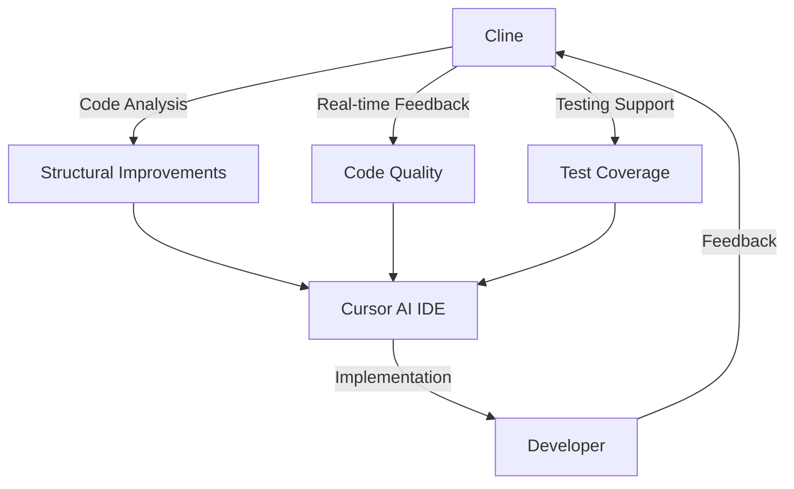

Below is a detailed strategy and set of recommendations tailored to your “Modern Streaming Hub” project that will not only keep your investment lean but also highlight your front end development expertise in your portfolio.

---

## 1. Clarify the Value Proposition

**Focus on demonstrating:**

- **Modern UI/UX Skills:** Your project should immediately convey that you’re comfortable with a modern, responsive, and dynamic user interface.
- **Robust Code Architecture:** Show that you can build a scalable, maintainable codebase using modular design and best practices.
- **Efficient Problem-Solving:** Emphasize rapid iteration and intelligent use of AI tools to optimize your workflow.

---

## 2. Leverage a Modern Tech Stack

Your current stack is already impressive. To maximize impact while keeping the project lean:

- **Core Technologies:**  
  - **React & TypeScript:** Ensure type safety and robust component design.  
  - **Vite:** Fast development and hot-module replacement.
  - **Tailwind CSS:** Rapid styling with a utility-first approach.
  
- **Key Libraries:**  
  - **Radix UI & shadcn/ui:** For accessible and flexible UI components.
  - **Framer Motion:** To showcase smooth, visually appealing animations.
  - **TanStack Query & Zod:** For efficient data fetching and robust schema validation.

*Tip:* Keep your dependency tree lean by importing only what you need, and be sure to document any custom configuration or architectural decisions.

---

## 3. Prioritize Core Features for Maximum Impact

Based on your analysis report, focus on features that are both impressive and feasible within a lean timeline:

- **Video Player Enhancements:**  
  - Develop custom controls (keyboard shortcuts, Picture-in-Picture, quality selection).  
  - Incrementally improve its testing coverage to demonstrate a strong commitment to quality.

- **Movie Card System & Interactive UI:**  
  - Implement hover-based previews and detailed modals.
  - Leverage smooth animations and responsive design to create a premium feel.

- **Responsive & Accessible Design:**  
  - Prioritize building a fully responsive layout (desktop and mobile).
  - Ensure accessibility best practices are followed to widen your audience and impress recruiters.

- **Authentication & Search/Filtering:**  
  - Even a minimal viable implementation can showcase your ability to integrate and secure user data.
  - Demonstrate state management proficiency through persistent user sessions and smart filtering.

---

## 4. Optimize Testing & Quality Assurance

Your testing strategy is a strong portfolio asset:

- **Unit & Integration Testing:**  
  - Increase coverage for the video player, modal components, and navigation.
  - Utilize Vitest for quick feedback during development.
  
- **E2E Testing (Future Investment):**  
  - Plan for an E2E suite (using tools like Cypress) to validate user flows.  
  - Consider visual regression testing to ensure UI consistency over time.

- **Performance Testing:**  
  - Integrate lazy loading and virtualization where possible (e.g., in long lists of movies) to showcase your performance optimization skills.

---

## 5. AI-Powered Development Workflow

Integrating AI tools can significantly streamline your development process:

- **Cline (Architecture & Planning):**  
  - Use it to analyze your project structure and suggest high-level architectural improvements.
  
- **Cursor AI (Real-Time Code Assistance):**  
  - Leverage it for quick code completions, refactoring, and inline documentation.
  
- **Sonnet Cloud & Sonnet 2.5:**  
  - Employ these for handling complex logic, API integration planning, and specific performance optimizations.

**Workflow Diagram Recap:**

This integrated approach not only reduces manual investment but also demonstrates your ability to harness modern AI tools—a key differentiator in today’s development landscape.

---

## 6. Address Structural Weaknesses

- **Component Architecture:**
  - Refactor heavy prop drilling by adopting a compound components pattern for complex UI elements.
  - Consider splitting large components into smaller, more manageable units with clear responsibilities.

- **State Management:**
  - Move towards a more centralized state management approach by enhancing your context strategy.
  - Define clear data-fetching and caching strategies, possibly using TanStack Query’s advanced features.

- **Performance Concerns:**
  - Implement lazy loading for heavy components.
  - Use virtualization techniques for long lists or grids of movie cards.
  - Optimize video quality switching to ensure seamless user experience.

---

## 7. Portfolio-Ready Presentation

Finally, remember that your portfolio should do more than just display code—it should tell a story about your process and growth:

- **Documentation & Case Studies:**  
  - Include detailed documentation, inline comments, and possibly blog posts or README sections that explain your architectural decisions and problem-solving approaches.
  
- **Live Deployment:**  
  - Deploy your project on platforms like Netlify or Vercel to offer live demos.  
  - Set up continuous integration (CI) pipelines (e.g., GitHub Actions) to showcase your professional development practices.

- **Code Repositories:**  
  - Maintain a clean, well-organized GitHub repository with clear commit histories and issue tracking to illustrate your workflow.

---

## Conclusion

By focusing on a modern tech stack, integrating key interactive features, implementing robust testing, and leveraging AI tools to streamline your development process, you’ll build a portfolio project that is both impressive and practical. This approach not only minimizes your upfront investment but also clearly demonstrates your capacity to design, develop, and optimize complex front end applications.

This strategy will position you as a forward-thinking developer who not only writes clean code but also embraces modern workflows and best practices—a combination that is highly attractive in today’s job market.