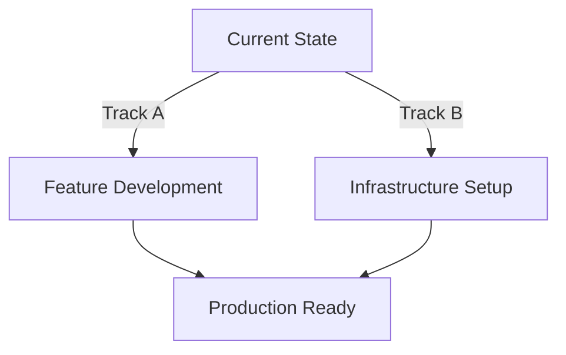

# Modern Streaming Hub - Strategic Development Guide
*Last Updated: February 21, 2024*

## 📋 Current Project Status

### Completed Features ✅
- Core video player functionality
- Movie card system with hover effects
- PRISM+ Original badge system
- Basic component architecture

### Testing Status 📊
- Unit Tests: 92% coverage ✅
- Integration Tests: 45% coverage 🚧
- E2E Tests: Not started ⏳

### Infrastructure Status 🏗
- Local development environment ✅
- Deployment pipeline: Not configured ⏳
- CI/CD: Not set up ⏳
- Environment management: Basic ⏳

## 🎯 Strategic Approach

We'll follow a dual-track development strategy to maintain momentum while building infrastructure:



### Track A: Feature Development 👨‍💻
Continue active development and testing of features.

### Track B: Infrastructure 🛠
Gradually implement deployment and CI/CD infrastructure.

## 📅 Implementation Timeline

### Week 1: Foundation
```bash
# Day 1: Vercel Setup
vercel init
vercel link
vercel env add PEXELS_API_KEY

# Day 2: Basic CI Setup
mkdir -p .github/workflows
# Create ci.yml (see CI/CD Configuration below)

# Day 3-5: Development
- Continue video player enhancement
- Improve test coverage
- Document setup
```

### Week 2: Enhancement
- Continue feature development
- Add feature flags
- Implement environment configs
- Enhance CI/CD pipeline

### Week 3: Refinement
- Complete core features
- Finalize testing pipeline
- Add monitoring
- Prepare for production

## 🔧 Infrastructure Setup

### 1. Basic Vercel Configuration
```json
// vercel.json
{
  "version": 2,
  "builds": [
    {
      "src": "package.json",
      "use": "@vercel/node"
    }
  ],
  "env": {
    "PEXELS_API_KEY": "@pexels_api_key"
  },
  "git": {
    "deploymentEnabled": {
      "main": true,
      "development": true
    }
  }
}
```

### 2. CI/CD Configuration
```yaml
# .github/workflows/ci.yml
name: CI
on: [push, pull_request]

jobs:
  test:
    runs-on: ubuntu-latest
    steps:
      - uses: actions/checkout@v2
      
      - name: Setup Bun
        uses: oven-sh/setup-bun@v1
        
      - name: Install dependencies
        run: bun install
        
      - name: Run tests
        run: bun test
        
      - name: Run lint
        run: bun run lint
        
      - name: Build
        run: bun run build
```

### 3. Environment Configuration
```typescript
// src/config/environment.ts
export const getEnvironmentConfig = () => {
  const env = process.env.NEXT_PUBLIC_VERCEL_ENV || 'development';
  
  return {
    isProd: env === 'production',
    isPreview: env === 'preview',
    isDev: env === 'development',
    apiKey: process.env.PEXELS_API_KEY,
    featureFlags: {
      newVideoPlayer: env !== 'production',
      aiRecommendations: env === 'development'
    }
  };
};
```

## 🎮 Development Priorities

### 1. Video Player Enhancement
```typescript
// Priority Tasks
- Complete playback controls
- Implement quality selection
- Add error handling
- Increase test coverage to 90%+
```

### 2. Modal Components
```typescript
// Priority Tasks
- Complete implementation
- Add animations
- Implement accessibility
- Add integration tests
```

### 3. Responsive Design
```typescript
// Priority Tasks
- Implement mobile-first approach
- Add touch interactions
- Test across devices
- Optimize performance
```

## 🧪 Testing Strategy

### 1. Unit Tests
```typescript
describe('VideoPlayer', () => {
  it('handles playback controls', () => {
    // Test implementation
  });
  
  it('manages quality selection', () => {
    // Test implementation
  });
});
```

### 2. Integration Tests
```typescript
describe('MovieCard Integration', () => {
  it('shows video preview on hover', async () => {
    // Test implementation
  });
  
  it('opens modal on info click', async () => {
    // Test implementation
  });
});
```

## 📊 Quality Gates

### Before Preview Deployment
- [ ] All unit tests pass
- [ ] Lint checks pass
- [ ] Build succeeds
- [ ] No TypeScript errors

### Before Production Deployment
- [ ] All tests pass (unit & integration)
- [ ] Performance benchmarks met
- [ ] Responsive design verified
- [ ] Feature flags configured

## 🔄 Development Workflow

1. **Feature Development**
```bash
# Create feature branch
git checkout -b feature/new-feature

# Development
bun run dev

# Testing
bun test
bun test:watch

# Push and Deploy
git push origin feature/new-feature
# Vercel creates preview automatically
```

2. **Code Review**
- Review preview deployment
- Check test coverage
- Verify feature flags
- Review performance

3. **Production Deployment**
```bash
# Merge to main
git checkout main
git merge feature/new-feature
git push origin main
```

## 📝 Documentation Requirements

### 1. Code Documentation
- JSDoc comments for components
- Type definitions
- Usage examples

### 2. Feature Documentation
- Implementation details
- Testing approach
- Configuration options

### 3. Deployment Documentation
- Environment setup
- Deployment process
- Troubleshooting guide

## 🎯 Success Metrics

### Development Metrics
- Test Coverage: 90%+ (unit), 80%+ (integration)
- Build Time: < 60 seconds
- Zero TypeScript errors

### Performance Metrics
- Lighthouse Score: > 90
- First Contentful Paint: < 1.5s
- Time to Interactive: < 2.5s

## 🆘 Need Help?

### Documentation
- [Vercel Deployment Guide](docs/deployment/vercel.md)
- [Testing Strategy Guide](docs/testing/strategy.md)
- [Feature Flags Guide](docs/features/flags.md)

### Commands Quick Reference
```bash
# Development
bun run dev         # Start development server
bun test           # Run tests
bun run lint       # Run linter
bun run build      # Build for production

# Deployment
vercel             # Deploy to preview
vercel --prod      # Deploy to production
```

*Note: This document should be updated as the project evolves and new requirements emerge.* 